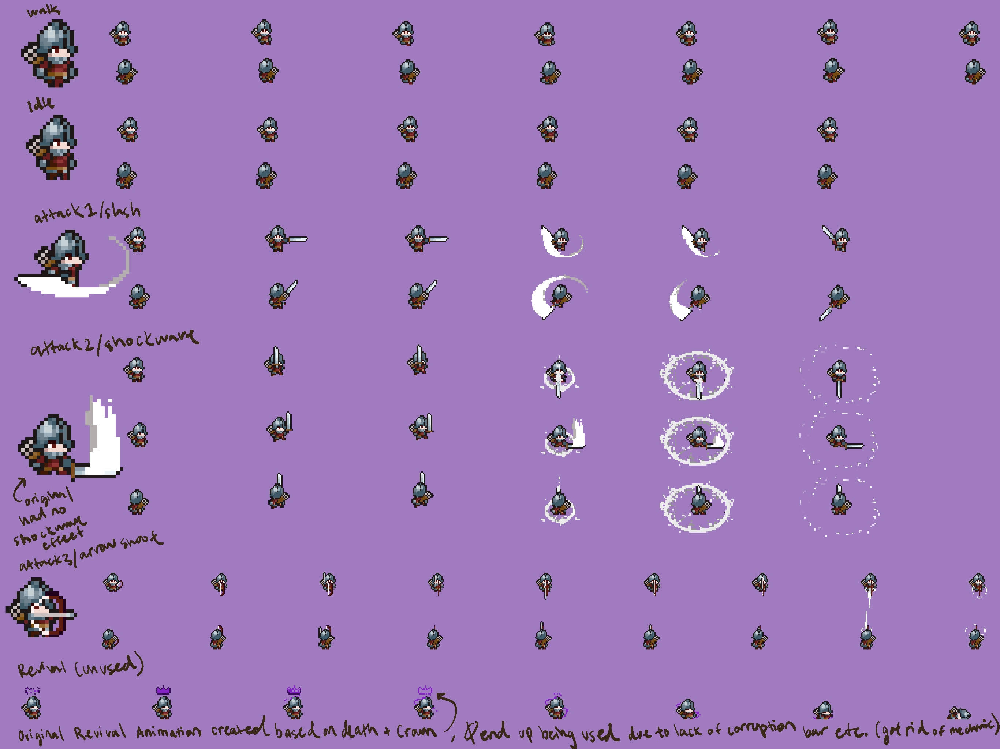
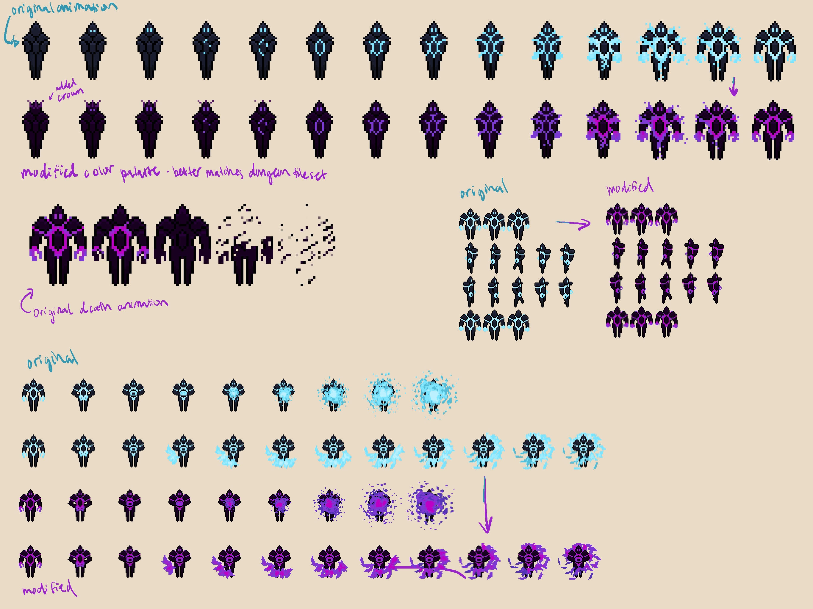
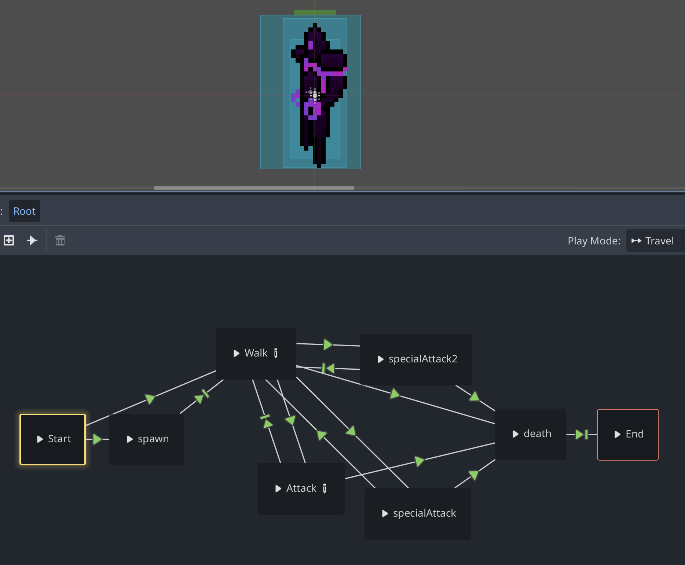
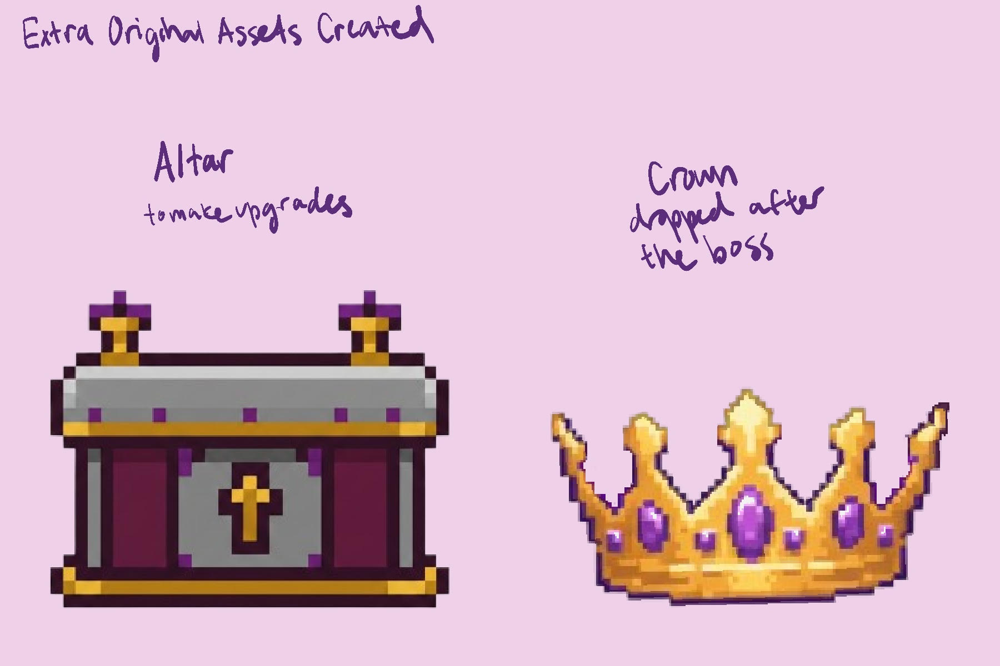
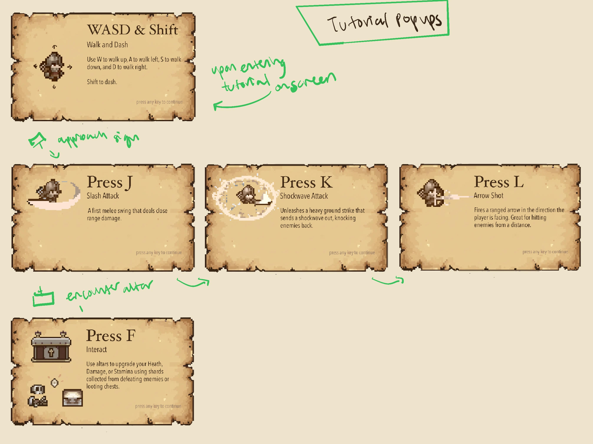

## Madeleine Oesterer
### Main Role: Visuals and Animations

### Asset Credits

#### Player
- **Soldier sprite & Arrow** from [Tiny RPG Character Asset Pack](https://zerie.itch.io/tiny-rpg-character-asset-pack)

#### Tilesets & Dungeon Objects
- **Dungeon tileset & animated objects** (torches, chest, candlestick, flag, trap)  
  from [Dungeon Asset Pack](https://pixel-poem.itch.io/dungeon-assetpuck)
- **Outside tileset** from  
  [Hana Caraka Topdown Tileset](https://otterisk.itch.io/hana-caraka-topdown-tileset)

#### Enemies
- **Vampire & Skeleton sprites** from  
  [Dungeon Asset Pack](https://pixel-poem.itch.io/dungeon-assetpuck)

#### Boss
- **Boss base sprite** from  
  [Animated Final Boss Sprites](https://newastronaut.itch.io/animated-final-boss-sprites)

#### Projectiles
- **Fireball animation** from  
  [Fireball Animation Pack](https://nyknck.itch.io/fireball-animation)

---

### Visual Style
Throughout the game all of my design decisions were guided by a cohesive visual style rooted in a dark medieval dungeon aesthetic that was blended with royal themes. This was gathered after our initial plan and the narrative of our game was thought up as a player cursed to roam the dungeon forever because they are cursed by a crown. Because the game was built using 16x16 pixel art tiles, after the tile set was chosen nothing could be overly large or detailed, instead the visuals rely on simplicity, clarity, with a hint of a nostalgic feel for older pixel art games. The color palette leans heavily into warm but shadowy tones with lots of reddish purples, deep royal purples, and gold accents. Keeping these in mind both unify the environment as well as emphasize the cursed crown narrative motif. This palette fuelled a lot of my original designs, from recoloring and modifying existing animations to creating the gameplay screens. To match the dungeon atmosphere I also wanted any UI elements to echo aged parchment and faded ink. Overall the visual direction embraces the charms of retro pixel art while simultaneously reinforcing the games’ royal dark fantasy identity.

---

## Player Animations & Additions
To save time I found most of our base assets on itch.io as seen linked above.

However in order to make the game more cohesive and feel more professional, a lot of the assets needed modifications or extra animations that weren't given through itch.io.

I started with the player. Our game is a top-down point of view, and this soldier asset that we are using for the player is built for platform games, so it lacked animations for all four cardinal directions. When facing left or right it's simple to just flip the existing animation, however I used the art app procreate to create the animations when the player is facing up or down (back or front) for all actions that required 4 directional animations. I created an additional two animations for walk, idle, three attacks (sword slash, sword shockwave, shooting an arrow), and even created a revival animation that used the death animation as a base but added a glowing crown which mysteriously revives the player. This revival animation was not used due to a lack of time and not implementing the corruption system that would have used the revival animation. The second attack, the sword shockwave also did not have the shockwave effect in the original animation so I created three animations for that one action that include the Shockwave of dust which is used to visually identify the knockback effect the player has on enemies. All of the animation sprite sheets shown in the image above work created by me. I then animated them using an animated player in Godot and set the right key frames and fiddled around with the timing so that the animation looked right.

The third attack is the player shooting an arrow, in Godot I created an arrow scene that was linked in the animation player of the corresponding attack so that the arrow would spawn at the right time with the animation. I created the base script for the arrow projectile that moves in a set direction, rotates to face its trajectory, and was later modified by our group member Leo to make sure that the arrow damages any enemy it collides with and deletes itself on impact. I also wrote the code snippets inside the player script _shoot_arrow() and _get_cardinal_direction() that spawn and position the arrow, choosing the direction based on the player's facing or movement and the offset so that it appears at the bow.

## Tilesets and Tile Animations
The tile sets were not modified visually by me, they were two separate tile sets found on itch.io, one for the dungeon and one for the outside tutorial level. The animated objects however came as several sets of separate PNG files which to my knowledge were not compatible with creating animated tile sets to be used throughout the level. I again used procreate to arrange the pngs in the correct format, a horizontal sprite sheet and then added to the project by making the animated tile sets within a separate tile map layer in Godot. This formatting was also used to make it easier to animate objects and in total I configured: the torches (side and front), chest, candlestick, flag, coins, and a trap (which we did not end up using).

## Enemies
The enemies, vampire and skeletons rights were found on itch.io. When searching for enemies I took into account art style as well as color to make sure these monsters were something I could see inhabiting the level, aka they didn't look out of place. After configuring them and animating them in godot I resized them to be relative to the player.
Later it was decided we wanted one of the enemies to have a projectile attack, however it was difficult finding an enemy on itch.io that had a projectile attack while also matching our visual style, so I found a fireball animation that could be added on to the vampire's existing attack (which was originally a bite) to make it look like the vampire was breathing a fireball at the player. The fireball scene was already created. I just added the animated sprite 2d.

## Boss Modifications & Additions
The boss assets are also from itch.io, I chose this asset because it had several attack animations and seemed to have four cardinal direction animations. Once I downloaded the asset I noticed this wasn't quite true, as only the walking animation seemed to have 4 directions. However, since our boss does not heavily rely on the animation to deal damage, but rather as an indicator for other projectiles being created with code, it ended up working out. The main thing I modified with the boss was the color palette. It was very clear that the original sprite animation color palette did not suit our visual style which included a lot of purples and gold and a darker dungeon aesthetic. I wanted to continue this visual language so for all the existing animations I modified the color palette to go from a light sci-fi blue glow to a mystical purple magic that better suited our needs. I also modified some of the animations to suit our vague narrative of the soldier being cursed by the boss. The cursed item used to inflict the curse upon the player is a crown. If you look carefully at the second row within the image, you can see a vague crown-like shape when it is spawning compared to the original right above it. I also created an original death animation for the boss, as the asset downloaded from itch.io did not have one. Again I animated the boss using an animated player, and created an animation tree with conditionals from one animation to the next as seen here.

## Small Original Additions
I created two small assets that are used throughout the game. I created the altar sprite, which is used to upgrade the player. I also designed the crown and created the scene and script in crown and the lines in boss that drop the crown as the boss’ position once the player has defeated the boss.

## Tutorial Popups and UI
On the tutorial stage, in order to get the player familiar with the game mechanics I created several tutorial pop-up screens in procreate. I also created the script within the tutorialPopup scene That controls the UI essentially and temporarily locks player input while the instructional pop-up is displayed. It also queues up the tutorial textures and shows them one at a time and automatically sizes them to fill the screen, advancing to the next image whenever the player presses any key. When the queue is empty it hides itself and unlocks the player again. In the RoomController script of the tutorial I added the relevant lines to use and call the tutorial pop-up screens. This includes the declaration reference to the pop-up, the pop-up instance, and the helper function that triggers the first tutorial screen.

The order is shown in the image here. Upon first entering the tutorial scene the first pop up is the walking and dash mechanics, The player can then walk all the way to a sign that they can encounter in the level to receive the next three instructions about the types of attacks, and then finally at the altar they can receive the interact instructions for how to deal with altars and chests.

Speaking of visual style, because this is a medieval inspired game I stuck with that aesthetic and created a scroll like background for the instructions and then used a dynamic frame from the corresponding animations, recoloring them to look like old ink on paper that's faded to brown and positioning them along with brown text explanations.

## Gameplay Screens and Scene Flow
Because our group lacks a User interface and Input Role, all of the screens I designed were created in the hopes of being easy to implement. I implemented the main scene changes in the godot scripts. They lack buttons but rather if they need user input, I stuck with ‘press any key to ‘blank’’. In procreate again I designed the start screen, and screen, and windscreen which are implemented as individual control-based scenes that all contain their own Logic for handling input or timed fades. I again implemented the script for all of these scenes. The start screen listens for any key or mouse press and then immediately loads the next gameplay scene which is TutorialOutdoors. I also implemented the logic for going to the end screen which reads ‘game over’ upon the player’s death and the Win Screen that shows when the boss is defeated and has dropped the crown. Both the end screen and the wind screen fade to black using a timed fade tween_property on a ColorRect Before changing the scene to return to the start screen. Essentially I created a loop with basic key press as user input due to lacking someone for the official role.

---

### Sub-Role: Audio

### Audio Credits

#### Background Music
- **BGM** from  
  [8-Bit Fantasy Adventure Music Pack](https://xdeviruchi.itch.io/8-bit-fantasy-adventure-music-pack)

#### Sound Effects
- **Player and Skeleton/Vampire attack sounds** from  
  [ZapSplat](https://www.zapsplat.com/)  
  *(Some effects edited/shortened by me.)*

---

The background music came from a single itch.io source. the 8-Bit fantasy music pack embodied the pixelated visuals with a slightly older game design and feel. There were several more songs however I chose to use just three of them. One for the start screen, one for the tutorial, and one for the main floor dungeon. Each scene had their own audio stream player with the music configured in Godot to autoplay, loop, and adjusted to background level decibels (-16).

I realized that having too many sound effects could actually be detrimental to the feel of a game. If there are too many of them it can feel overwhelming and cluttered. The sound effects all came from zapsplat.com However I edited some of the effects in a simple browser audio editor in order to shorten them and cut out unnecessary parts of the files. The player and the enemies (vampire and skeleton) each have a sound for all of their attacks as well as a sound that plays upon their death. The player has three attacks so three corresponding sounds which I attempted to match to the movement. The sword slash sounds like a sword slash. The shockwave sound is the rumbling from a landslide, a shortened snippet. The arrow was a simple bow twang (shortened for time). The player's death is a simple thump as if the player is falling to the ground. The skeleton also has a swiping sound as it's attacking with some sort of scythe. However, I added a squelching effect to make the sound slightly more visceral as an attack. When the skeleton dies you can hear a cluttering sound as if a pile of bones has fallen (shortened from a longer cluttering sound). The vampire attack sound is a growl that matches up with a snarling fireball being hurled. The vampire death sound is a groan, because this figure is already undead and turns to ash, I wanted it to feel like a whisper. The boss also has a few sounds, one corresponding to its spawning, one for each of the attack animations (a punch, magic swish, disorienting reversal of an audio snippet) and one for its death (a tired echoing roar) that reflect the boss’ demise in a large cavern that is the dungeon room. As there weren't too many sound effects that corresponded to each character, I used a simple audio stream player 2D for each sound and modified the script to include the audio players as onready variables and played them along with the animations.

---

### Outside My Role

Outside of my role,  I've already mentioned a few things that I think would sit outside of a purely animation and visual. I implemented the shooting arrow and cardinal direction logic as mentioned earlier  which goes slightly under game mechanics programming. I also created the tutorial pop up scene logic with a scripted q-based display and input locking. I also wrote interaction logic for the pop-ups and the starscreen so that pressing any key would progress the tutorial. This goes slightly into UI/UX engineering and gameplay flow scripting territory. Building off of that is the scene flow and game Loop. I created the start -> tutorial -> dungeon -> win/lose -> restart loop Logic and scripts for the transitions, input handling, fades, and the flow diagram. 

For behind the scenes work, we didn't have a producer, so many of the small things a producer would normally be in charge of I helped contribute to. I instigated and created a lot of the communication channels and servers we used as a group. I also reached out to the other groups and organized meetups for when to do the project reports. I created the slide that was used in the final presentation. I created and uploaded the web version of our game to itch for the presentation and final version. I also tended to write a lot of the base paragraphs on our progress reports (the one we did on ourselves as well as the other group).

---